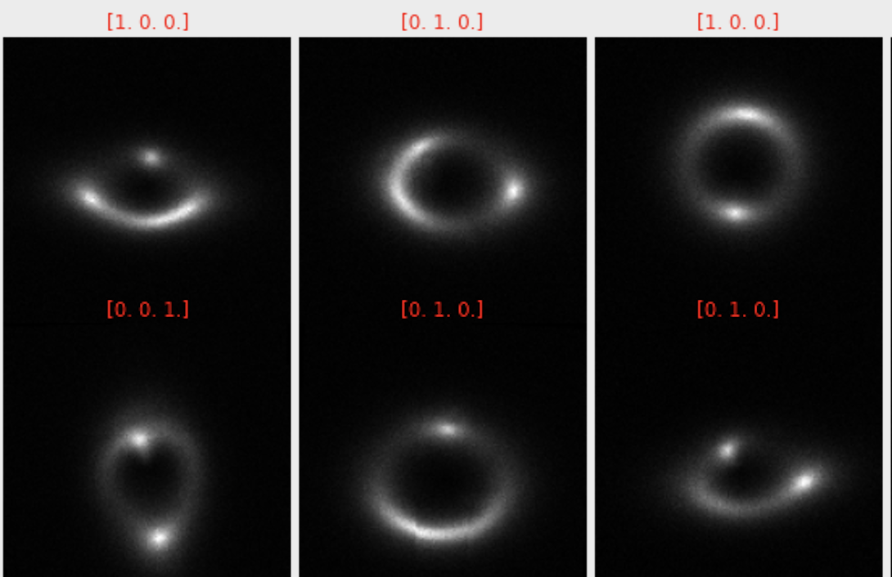

# ML4SCIHackathon2021-GravitationalLensing-Solution

1st place solution of the [ML4SCI Hackathon 2021](https://github.com/ML4SCI/ML4SCIHackathon) Gravitational Lensing Challenge.

## Challenge - Multi-Class Image Classification

Identify dark matter halos based on strong lensing images with different substructure.

## Solution

Trained a EfficientNetB3-based model with GeM Pooling and cosine annealed warm restart learning scheduler.

## Results

The micro AUC = 0.99834 evaluted on validation dataset.

## Code

The training is done with Google Colab.

The notebook `notebooks/convert_data_to_tfrecords.ipynb` downloads the data and converts them in tfrecords format. The training part is in `notebooks/training.ipynb`.
